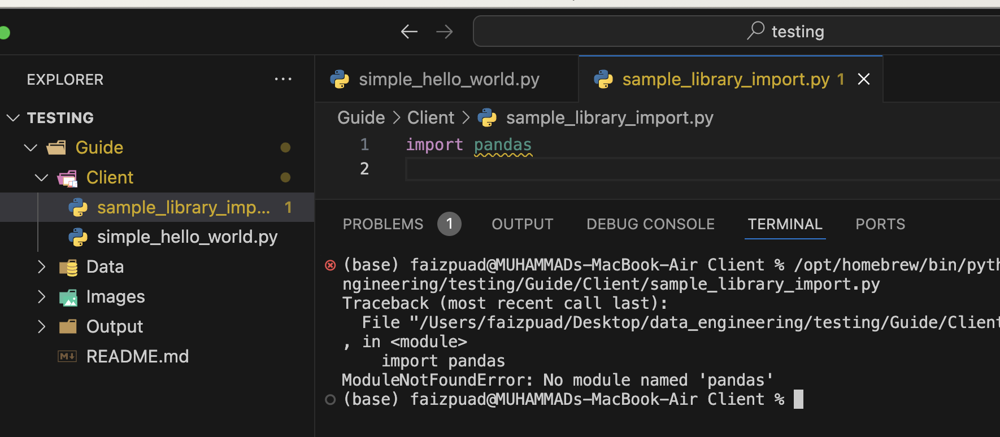
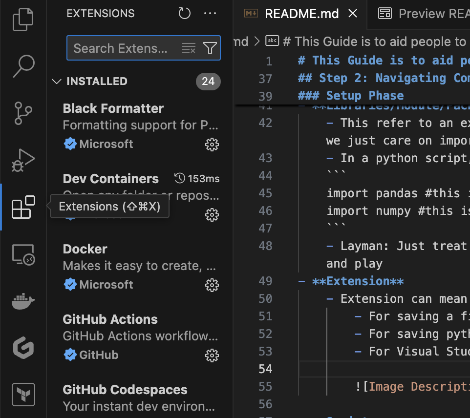
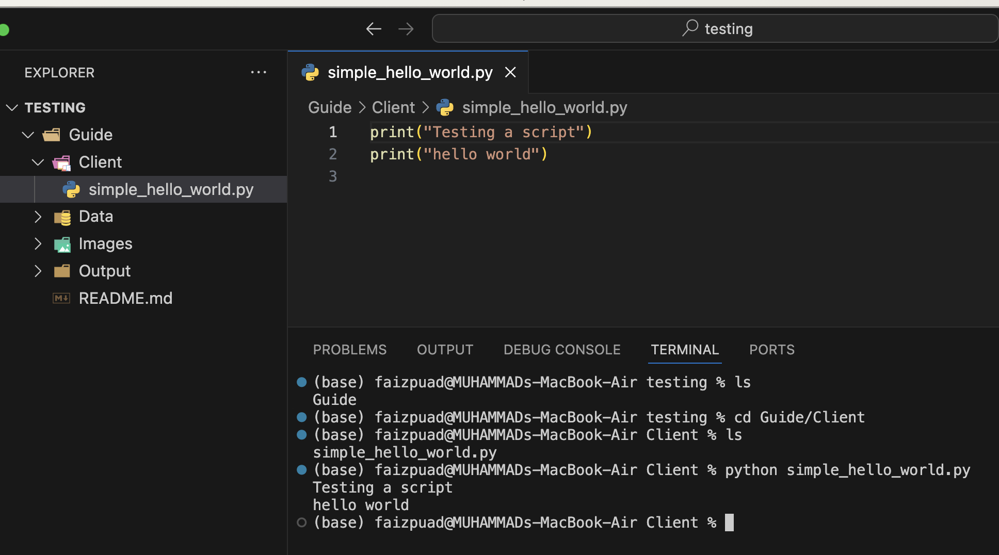
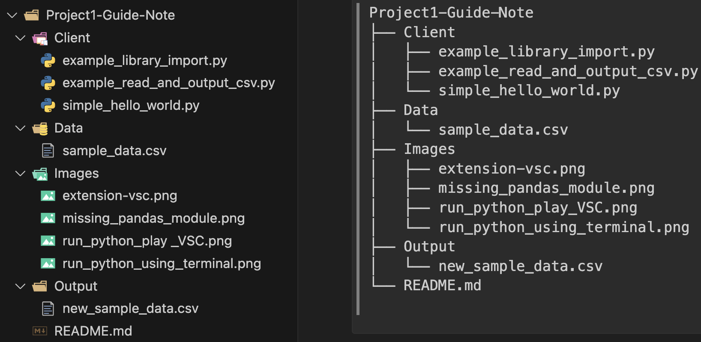
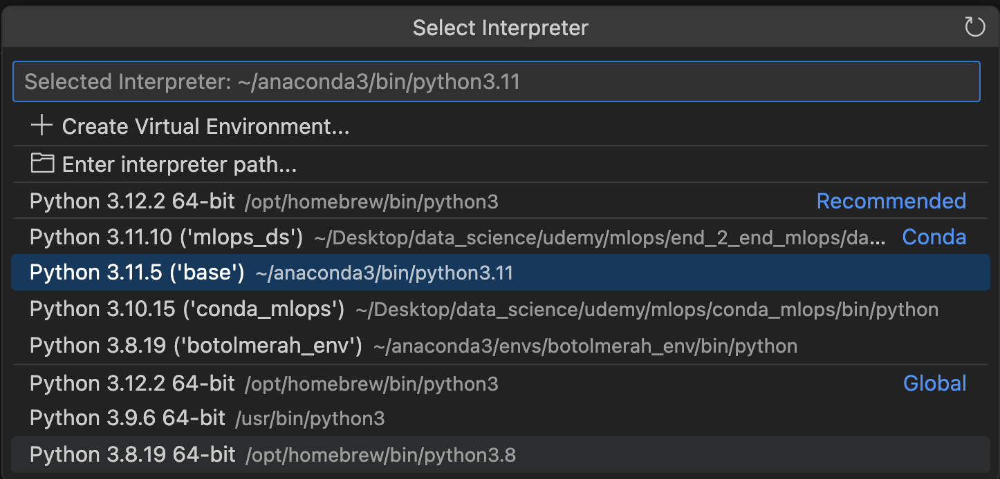
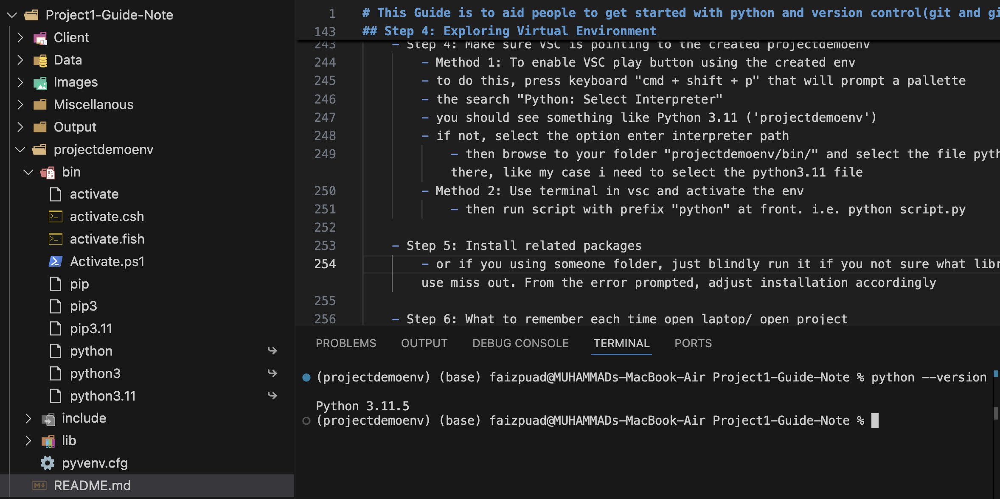

# 🐍 This Guide is to aid people to get started with Python common setup process, hopefully faster 🏋️‍♂️ 😎

```
Quick summary, you will learn how to: 🎯

- Setup/install Python from scratch 🔧
- Learn and explore common folder setup for any Python project 📂
- Create virtual environment via 2 methods 🌐
```

## Step 1: Make sure to install Python beforehand by using `terminal` 💻 
There are two methods you can approach: 
- **Method 1:** Install only Python -> [Python Installer MacOs](https://www.python.org/downloads/macos/) 📦
    - **Reference/Guide:** DataQuest has a nice guide article for this -> [DataQuest Python Install Guide](https://www.dataquest.io/blog/installing-python-on-mac/) 📚
    - I already installed Python, what should I do next? 🤔
        - Verify installation by running the code below. If successful, it will show a list of packages 📋
        ```
        python --version
        or
        python3 --version
        ```
- **Method 2:** Install common/bundle data analytic package via Conda -> [Miniconda](https://docs.anaconda.com/miniconda/install#quick-command-line-install:~:text=the%20.pkg%20installer.-,Miniconda,-is%20a%20smaller) 🐍
    - What is Miniconda? 🤷‍♀️
        - Generally, there are `2 ways` to install a bundled Python with common packages (pandas, numpy, etc.) 📊
            - The bigger bundle is named `Anaconda`. Bigger means more libraries are available 🌈
            - The smaller bundle is named `Miniconda` 🤏
        - **Reference/Guide:** DataQuest has a nice guide article for this -> [DataQuest Anaconda Guide](https://www.dataquest.io/blog/how-to-install-the-anaconda-distribution-on-your-computer/) 📖
    - I already installed Miniconda or Conda, what should I do next? 🤨
        - Verify installation by running the code below. If successful, it will show a list of packages 📝
        ```
        conda list
        ```
- **Knowledge Check:** If you still have a blurry line on distinguishing Python vs. Conda/Miniconda, feel free to check the link below: 🧐
    -  **Reference/Guide:** DataQuest has a nice guide article for this -> [DataQuest Python vs Anaconda/Miniconda](https://www.dataquest.io/blog/python-vs-anaconda/) 🔍
        - Summary: Article explained each entity and showed how to set up `virtual environment` using those two methods, and even showed setup of Visual Studio Code with Python extension 🛠️

## Step 2: Learning Common Terms 📚
Common terms that I usually encounter and use when preparing a project either from scratch (like I just bought a new laptop, how to install everything) or simply just creating a new second-time project. The terms are:

- **Visual Studio Code (VSC) term** 💻
    - VSC is a code editor. There are other code editors out there. 🖥️
    -  **Reference/Guide:** RealPython has a nice guide article for this -> [Code Editors for Python](https://realpython.com/python-ides-code-editors-guide/) 📝
    - Layman: Treat it like a book where you use your pencil to write on 📖

- **Libraries/Module/Package term** 📦
    - This refers to an existing template. A template can come like multiple if-else statements that someone has built before. But for us, we just care about importing them 🧩
    - In a Python script, below code is what it looks like. Note that '#' here means a comment and not the running part of code:
    ```
    import pandas #this is Libraries/Module/Package
    import numpy #this is Libraries/Module/Package
    ```
    - Layman: Just treat it like a normal PowerPoint design template where someone already designed your slide nicely and you can just plug and play 🎨
    - How to know if I require a library? When you get below screenshot error in terminal. 
        - Usually, to read an error in Python, it always is in the last line. Like in the image, it says no module name pandas. Aha! You already learned module = libraries = package, right? 🤔

        

        - No module name pandas means your Python does not have the pandas package yet 🚫
            - In this case, need to install it via `terminal` (if it does not work, copy the error and prompt into ChatGPT) 💬
            ```
            #install using python pip
            pip install pandas

            #install using conda (if u install anaconda/miniconda)
            conda install pandas
            ```
        - Notice that even the script name is highlighted yellow in VSC (means there is some problem) ⚠️
        - **Alert !!! :** Some modules/libraries require certain versions of Python. Some only support outdated Python versions and vice versa. Installing each time like our current step is not recommended. Thus, we will explore the concept of virtual environment in Python. 🔍

- **Project/Code Dependency term** 🔗
    - Project dependency means all the Python's installed version, Python's libraries, custom script needed to run a project or even not just Python but other related stuff. *Without the dependency, when you run the script, you will get the error of something is not found* 🕵️‍♀️

- **Extension term** 📂
    - Extension can mean different things:
        - For saving a file, it can mean your `.txt` for text file, `.csv` or `.xlsx` for spreadsheet
        - For saving Python script, it means `.py`
        - For Visual Studio Code (VSC), extension means as below image. VSC might require Python extension to use it seamlessly in writing code like detecting wrong syntax or any invalid code 🛠️

        

- **Script term** 📜
    - Script refers to the content you write your code on. For example, if I save below code in a file named `simple_hello_world.py`, the file `simple_hello_world.py` is what is called a Python `script` *because I write code using Python language in a script*. 
    ```
    print("Testing a script")
    print("hello world")
    ```
    - To run the script, two ways can do: 🏃‍♀️
        - Way 1: Use terminal (Ensure file running on directory with the script)
            - The first sentence in terminal is "python" followed by script name 💻

        

        - Way 2: Use VSC play button (Ensure file running on directory with the script). It will still output in terminal ▶️

        

- **Terminal term** 🖥️
    - This is the interface used commonly for:
        - Fresh install language like Python
        - Fresh install library
        - Creating a new folder instead of using mouse (Graphical User Interface - GUI)
        - Running a command
    - Both your laptop/PC and code editor (i.e., VSC) have terminal. Can use either one 🖱️

- **README.md or markdown term** 📄
    - You're probably wondering:
        - Why in GitHub or Python file I always find this README.md?
        - What language is this README.md written in?
        - Why is it called README.md?
    - README.md or markdown file is the usual way people document a project. You can put images, YouTube links, some gif animations, and even make it prettier by having headers, subsections, etc. 🎨
    - Extension ".md":
        - Markdown file is denoted with extension ".md"
        - People usually use the name "README.md" because in GitHub, the first layer of a folder structure should put some remarks or documentation. And by default, GitHub detects the name "README.md" and will auto-display it but only on the first layer 📂
        - You can rename it into anything with ".md" like "Food.md", "My_note.md"
        - The strange way text is written is called markdown format
            - Try it by prompt/ask ChatGPT (but Claude.ai I think better at this) 🤖
            ```
            provide me a simple writeup about chicken not more than 100 words.Provide me the output in markdown format and just try make it prettier with some heading, section, bullet, code section
            ```
- **Git and Github term** 🌐
    - Git is a tool for version control. What is it controlling? 🕹️
        - Scenario:
            - Let's say you write a few lines of code, saved it and it works. Perfect! But later time you edit the script a few times, on and off the laptop for a while, then suddenly code not working or you prefer previous solution. But now, you have limited ways to go backward to the `version` you want by "CMD + Z or Control + Z" 🔙
        - Git to the rescue! 🦸‍♀️
            - By using Git, you can make every little change of your code trackable and feel free to jump into a specific version of your code 🏃‍♀️
    - GitHub is a repository that hosts/contains your Git file 📦
        - Layman: If repository seems weird, treat it like a Google Drive but tailored for special use case which is to track & version control 🗄️
    - You probably found a ".gitignore" in people's projects. That means people are using version control. ".gitignore" is a file that lists all the folder paths or file names that should not be tracked. I.e., sensitive information 🔒

## Step 3: Navigating Project Structure 📂
Below shows the common folder structure with graphical icon side by side: 🗂️



I believe the folder naming and structure is flexible as long as it is sensible. However, it is good to have clear separation like: 🧩
    - Client is for the scripts on your local computer 💻
    - Data is your raw data 📊
    - Output is the processed raw data 📈
    - Images is a collection of images I use with this README.md 🖼️

A good separation of tasks by folder structure improves project readability, makes each task more modular, and easy to inspect, debug if an error happens. 🔍

## Step 4: Exploring Virtual Environment 🌐
Virtual Environment enables us to create a project independently/in isolation without interfering with other projects. What? 🤔
- Let's have a scenario: 📖
    - Suppose a project requires you to use Python version 3.6 because some of the library only supports that version. However, your second project requires using Python 3.8. It is troublesome to install multiple Python versions. It gets complicated over time when you want to run a simple Python script later on, due to confusing Python version use 🤯

- Virtual environment to the rescue! 🦸‍♀️
    - Three ways to create a virtual environment via (`virtualenv`, `conda` and `pipenv`). *I'm only touching on the first two methods* 🛠️
        - Method 1: virtualenv 🐍
            - Create env with specific Python version. In this case, I'm using Python 3.8. Or use just python, it will by default use the latest version available on your system 💻
            
                (make sure your terminal is inside the project structure preferably)

                Run in terminal below code 🖥️
                ```
                python3.8 -m venv myvirtualenv
                ```

                Then in terminal, activate/deactivate the virtual environment with that custom name "myvirtualenv" 🔄
                ```
                # for mac
                ## activate
                source myvirtualenv/bin/activate
                ## deactivate
                deactivate

                # for windows
                ## activate 
                myvirtualenv\Scripts\activate 
                ## deactivate 
                deactivate
                ```

                Then just install any libraries with specific version or without (to use the latest version) 📦
                ```
                pip install pandas=1.2.3
                ```

            - Disadvantage: For each Python version you want to create the virtual env with, **you need to install the Python version first** ⚠️

        - Method 2: Conda 🐍
            - If you have Anaconda or Miniconda installed on your system, you can use the conda command to create a virtual environment. Create a new conda environment with a specific Python version in terminal: 💻

                ```
                conda create -p ./myvirtualenv python=3.8
                ```

                Activate/deactivate the conda environment in terminal: 🔀
                ```
                # For Mac/Linux
                source activate my_env
                conda deactivate
                
                # For Windows
                conda activate my_env
                conda deactivate
                ```

                Install packages in the activated conda environment using terminal: 📥
                ```
                conda install pandas
                ```

                Advantage: Conda environments come with their own Python installation, so you don't need to install Python separately for each environment 🌟

            **Knowledge check:** Pip install vs. Conda install for a module/library/package 🤔
                
                - Package Sources: 📦
                    - Conda install installs packages from the Conda package repositories, which include a wide range of scientific and data-related packages.
                    - Pip install installs packages from the Python Package Index (PyPI), which has a broader set of packages, including those not necessarily related to scientific computing

                - Performance and Stability: 🚀
                    - Conda environments are generally more stable and performant, especially for scientific and data-related packages
                    - Pip can sometimes have issues with binary packages and dependencies, leading to installation problems or unstable environments

                However, if a specific package is not available in the Conda repositories, you can use pip install to install it within the Conda environment. Both will only install packages as isolated to only that environment 🔒

- Demo on how to use the virtual environment by starting a project from scratch or using someone's folder 🛠️

    - **DEMO VIDEO**

    [](https://youtu.be/Q6O0lApLI_U)

    - Step 1: Create a project folder (just refer to the image before for project structure) 📂
        - Let's say you just clone / copy some project in a GitHub repository, then that will be your initial project structure 😁

    - Step 2: Navigate into the folder main directory 🚶‍♀️

    - Step 3: Create virtual environment 🌐
        - In this project, I use virtualenv method on Mac 💻

            ```
            # create virtual env
            python -m venv projectdemoenv
            ```

            *Note: My current system has Python 3.11.5 installed. If I don't specify the Python version in venv, it should use the latest available version in the system* 🔍

            Activate the virtual environment "projectdemoenv" 🚀
            ```
            # create virtual env
            source projectdemoenv/bin/activate
            ```

            After activated, you should see the env name in bracket 👀
            ```
            # before activate
            (base) user@macbook Project1-Guide-Note % 

            # after activate
            (projectdemoenv) (base) user@macbook Project1-Guide-Note % 
            ```

    - Step 4: Make sure VSC is pointing to the created projectdemoenv 🎯
        - Method 1: To enable VSC play button using the created env 🖥️
        - To do this, press keyboard "cmd + shift + p" that will prompt a palette
        - Then search "Python: Select Interpreter"
        - You should see something like Python 3.11 ('projectdemoenv') 🕵️‍♀️

            

        - If not seeing it like in image above, select the option enter interpreter path 🔍
            - Then browse to your folder "projectdemoenv/bin/" and select the file python there, like in my case, I need to select the python3.11 file 📂

            

        - Method 2: Use terminal in VSC and activate the env 💻
            - Then run script with prefix "python" at front. I.e., python script.py 🏃‍♀️

    - Step 5: Install related packages 📦
        - Or if you're using someone's folder, just blindly run it if you're not sure what library is missing. From the error prompted, adjust installation accordingly 🛠️

    - Step 6: What to remember each time you open a laptop/open project 💡
        - Make sure env is already active, if not activate it before use. **DO NOT** install new package if not in an activate environment. That's it 🚀
        - Or easier way is before opening your VSC, use the terminal: 💻
                
                Using Command Line
                ```
                # Activate your virtual environment:
                ## Unix/Mac
                source projectdemoenv/bin/activate
                ## Windows
                projectdemoenv\Scripts\activate 

                # Open VSCode from the same terminal:
                code .
                ```
            - If you can't use "code ." in terminal, make sure to open the VSC first: 🖥️
                - Press keyboard "cmd + shift + p" that will prompt a palette
                - Then search "Shell command: install 'code' from PATH" 🔍
                - If later someday code . doesn't work again
                    - Then search "Shell command: uninstall 'code' from PATH" 🚫
                    - Reinstall back "Shell command: install 'code' from PATH" 🔧

Happy Coding! 🎉👩‍💻👨‍💻🐍
